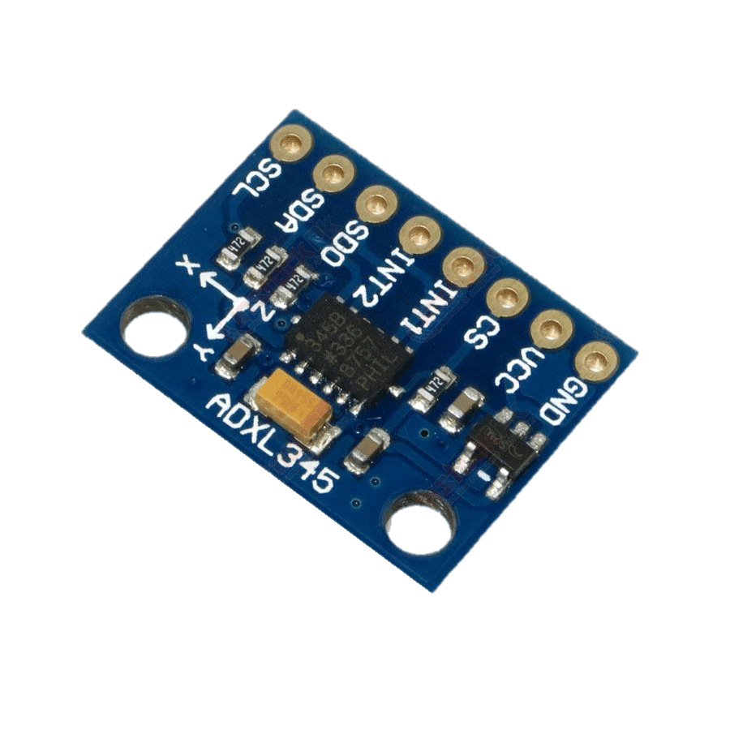

# ADXL345 Lua driver

A [lua-periphery](https://github.com/vsergeev/lua-periphery) based sensor driver for the ADXL345 3-axis accelerometer.

## Using

### Taking a reading

```lua
local adxl345 = require 'adxl345'
local periphery = require 'periphery'

local i2c = periphery.I2C('/dev/i2c-1')
local x,y,z = adxl345.readAcceleration(i2c)

print(string.format('x = %2.3f', x))
print(string.format('y = %2.3f', y))
print(string.format('z = %2.3f', z))
```

Sample output:

```
x = -0.028 G
y = 0.060 G
z = 1.036 G
```
